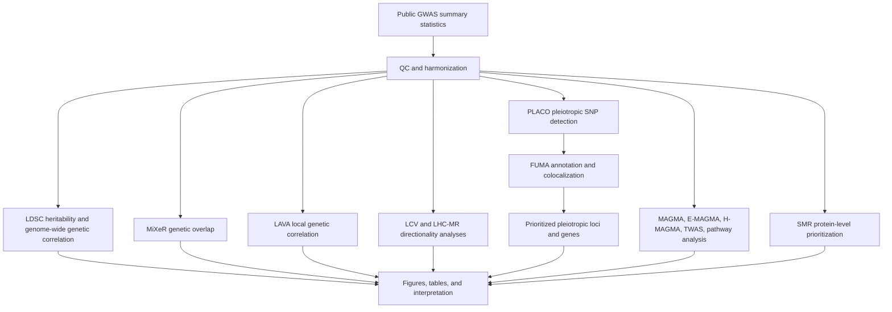

# Shared Genetics of Breast Cancer and Psychiatric Disorders

This repository contains analysis scripts and workflow documentation for the manuscript:

**Investigating the Shared Genetic Landscape Between Breast Cancer and Psychiatric Disorders: A Genome-wide Cross-trait Analysis**

The repository documents the execution order, required inputs, expected outputs, software dependencies, and commands used to reproduce the main genetic analyses from publicly available GWAS summary statistics.

## Repository Contents

```text
.
├── README.md
├── environment.yml
├── scripts/
│   ├── run_ldsc_h2.sh
│   ├── run_ldsc_rg.sh
│   ├── MiXeR.sh
│   ├── LAVA.sh
│   ├── LCV.sh
│   ├── runlcv.R
│   ├── run_lhcmr.sh
│   ├── run_lhcmr.R
│   ├── PLACO.sh
│   ├── run_placo.R
│   ├── MAGMA.sh
│   └── SMR.sh
├── config/
│   ├── config.example.sh
│   ├── paths_template.tsv
│   ├── software_versions.tsv
│   └── trait_pairs.tsv
├── docs/
│   ├── data_sources.md
│   ├── input_output.md
│   ├── reproduce_figures_tables.md
│   └── workflow_overview.md
├── data/
│   ├── README.md
│   ├── raw/
│   ├── harmonized/
│   └── reference/
├── results/
│   ├── README.md
│   ├── ldsc/
│   ├── mixer/
│   ├── lava/
│   ├── lcv_lhcmr/
│   ├── placo/
│   ├── fuma_coloc/
│   ├── magma/
│   ├── pathway/
│   ├── smr/
│   └── figures_tables/
└── logs/
```

## Data Availability

All GWAS summary statistics used in this study are publicly available from the original studies, consortia, or repositories. The direct download links, PubMed IDs, sample sizes, ancestry information, reference genome information, and dataset version/freeze or access dates are provided in Supplementary Table 1 of the manuscript.

Raw GWAS files are not redistributed in this repository when source-specific data-use terms require users to obtain them from the original source. The scripts and documentation in this repository describe how to regenerate the processed analysis inputs and final result tables from those public sources.

## Quick Start

1. Download the public GWAS summary statistics listed in Supplementary Table 1 of the manuscript.
2. Download required reference resources, including HapMap3 SNPs, 1000 Genomes EUR LD reference files, LAVA LD blocks, MAGMA gene location files, and QTL summary resources as needed.
3. Copy `config/config.example.sh` to a local configuration file and update all `/path/to/...` placeholders.
4. Harmonize GWAS summary statistics into the expected formats described in `docs/input_output.md`.
5. Run the analysis modules in the order listed below.
6. Use `docs/reproduce_figures_tables.md` to map each figure or table to its corresponding scripts and output directories.

## Analysis Workflow

The analyses should be run in the following order.

### 1. GWAS Download and Harmonization

Download all GWAS summary statistics from the sources listed in Supplementary Table 1. Harmonize each dataset to a common genome build and allele format. Remove variants with missing rsID, duplicated variants, sex chromosome variants, MHC-region variants, and variants below the minor allele frequency threshold used in the manuscript.

Expected outputs:

```text
data/harmonized/<trait>.sumstats.gz
logs/harmonization/<trait>.log
```

### 2. LDSC SNP Heritability and Genetic Correlation

```bash
bash scripts/run_ldsc_h2.sh
bash scripts/run_ldsc_rg.sh
```

Expected output directory:

```text
results/ldsc/
```

### 3. MiXeR Genetic Overlap

```bash
bash scripts/MiXeR.sh
```

Expected output directory:

```text
results/mixer/
```

### 4. LAVA Local Genetic Correlation

```bash
bash scripts/LAVA.sh
```

Expected output directory:

```text
results/lava/
```

### 5. Directionality Analyses: LCV and LHC-MR

```bash
bash scripts/LCV.sh
bash scripts/run_lhcmr.sh
```

Expected output directory:

```text
results/lcv_lhcmr/
```

These analyses provide model-dependent genetically inferred directional evidence and should not be interpreted as definitive causal proof.

### 6. PLACO Cross-Trait Pleiotropy

```bash
bash scripts/PLACO.sh
```

Expected output directory:

```text
results/placo/
```

PLACO-significant SNPs were used for FUMA annotation and downstream prioritization.

### 7. FUMA Annotation and Colocalization

Upload PLACO-significant variants to FUMA using the parameters reported in the STAR Methods. Perform Bayesian colocalization for FUMA loci using the priors and PP.H4 threshold reported in the manuscript.

Expected output directory:

```text
results/fuma_coloc/
```

### 8. MAGMA, E-MAGMA, H-MAGMA, TWAS, and Pathway Analyses

```bash
bash scripts/MAGMA.sh
```

Expected output directories:

```text
results/magma/
results/pathway/
```

### 9. Protein-Level SMR Analysis

```bash
bash scripts/SMR.sh
```

Expected output directory:

```text
results/smr/
```

SMR findings are reported as genetically prioritized protein-level signals and require tissue-specific or experimental validation before mechanistic interpretation.

## Workflow Overview



## Reproducibility Notes

- Keep software versions and package versions consistent with `config/software_versions.tsv`.
- Preserve logs for harmonization, LDSC, MiXeR, LAVA, LCV/LHC-MR, PLACO, MAGMA, and SMR.
- Large reference files and public GWAS datasets are not included in this repository.
- Update all placeholder paths before running scripts.
- For exact manuscript figure and table reproduction, see `docs/reproduce_figures_tables.md`.

## Citation

If using this workflow, please cite the manuscript and the original GWAS/data resources listed in Supplementary Table 1.
