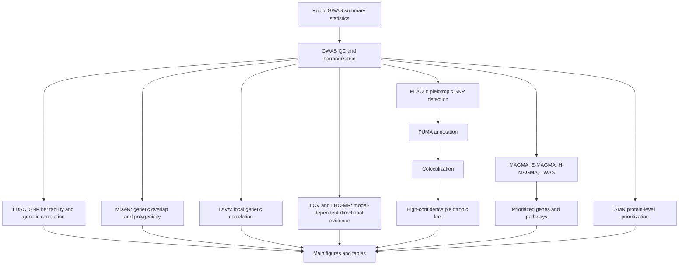

# Workflow Overview

The study combines complementary genome-wide and locus-level analyses to evaluate shared genetic architecture between breast cancer and psychiatric disorders.

Interpretation notes:

- Genetic correlation and overlap analyses quantify shared genetic architecture but do not establish direct causality.
- LCV and LHC-MR provide model-dependent directional evidence.
- PLACO and colocalization prioritize pleiotropic loci.
- Pathway and tissue enrichment results reflect statistical overrepresentation, not direct pathway activation.
- SMR outputs are interpreted as genetically prioritized protein-level signals requiring validation.

